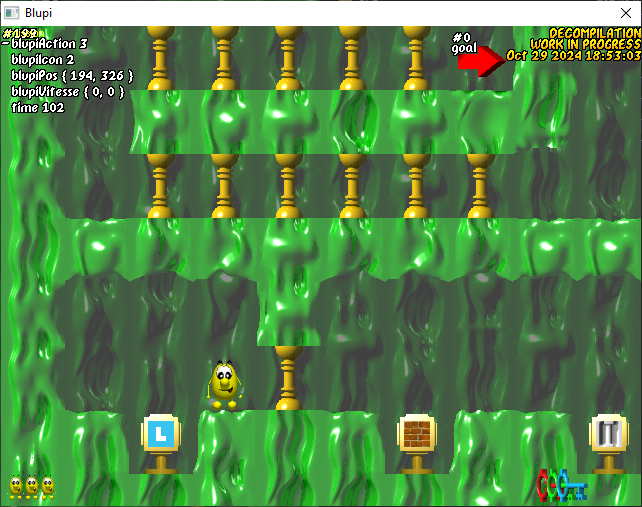

# sb2-decomp
 

 Currently, no source code has been publicly released for Speedy Blupi.  We are using the disassemblers Ghidra and IDA to inspect the game binaries, and comparing with the official Planet Blupi source code.
 
 Some demangled symbol names are taken from the 2013 Windows Phone version of Speedy Blupi, which we inspected using ILSpy.  Big thanks to Ч.У.Ш on the 4PDA forum for archiving this obscure version of the game!!!
 
 Gameplay is functional, but defective and missing many features.
 
 These files currently need the **most attention**, in order of priority:
 - event.cpp
 - decblupi.cpp
 - decio.cpp
 - decdesign.cpp
 - decblock.cpp
 - decmove.cpp
 - decnet.cpp
 - decor.cpp
 - misc.cpp

 These files are tentatively **complete**, but require further testing:
 - blupi.cpp
 - button.cpp
 - jauge.cpp
 - menu.cpp
 - movie.cpp
 - network.cpp
 - pixmap.cpp
 - sound.cpp
 - wave.cpp